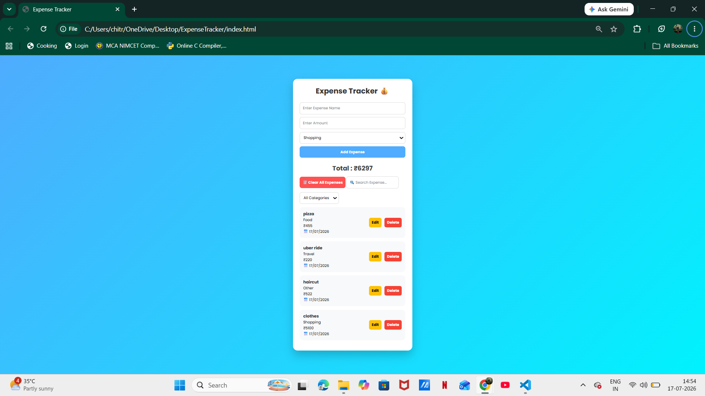

# 💰 Expense Tracker

A simple and responsive Expense Tracker built using HTML, CSS, and JavaScript.

## 🚀 Features

- Add Expenses
- Edit Expenses
- Delete Expenses
- Search Expenses
- Filter by Category
- Local Storage Support
- Date Tracking
- Clear All Expenses
- Responsive UI

## 🛠 Tech Stack

- HTML5
- CSS3
- JavaScript
- Local Storage API

## 📷 Preview

## Live Demo

[https://tumhari-website-link.com](https://chitranshik288-lang.github.io/Expense-Tracker/)

## 📌 Future Improvements

- Expense Charts
- Dark Mode
- Export to CSV
- Monthly Analytics
- User Authentication

## 👩‍💻 Author

Chitranshi Khare
